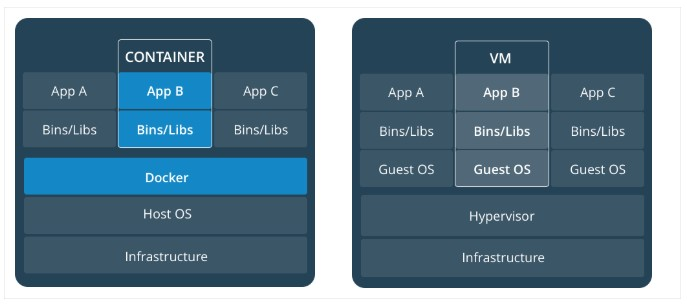

**Table of Content**
	<li>What is docker and it's advantage?</li>
	<li>2. Difference between container and virtual machine<li>
	3. What is docker engine and it's architecutre?
	4. What is Docker image,registry and container?  
	5. What is snapshot ?
	6. Why guest OS not required in the docker container?
	7. What is kernel?
	8. Difference between kernel space and user space
	9. Deference between deamon and process?
	10. Deep drive regarding hasing function
	11. What is the meaning of ephemeral ?
	12. What is REST API and how it's work.
	13. What is database persistence layer?
	
<h2>What is Docker</h2>
Docker is a platform for developers and sysadmins to  **build, run, and share**  applications with containers. The use of containers to deploy applications is called  _containerization_. Containers are not new, but their use for easily deploying applications is.
<h3>Advantage of docker</h3>

-   **Flexible**: Even the most complex applications can be containerized.
-   **Lightweight**: Containers leverage and share the host kernel, making them much more efficient in terms of system resources than virtual machines.
-   **Portable**: You can build locally, deploy to the cloud, and run anywhere.
-   **Loosely coupled**: Containers are highly self sufficient and encapsulated, allowing you to replace or upgrade one without disrupting others.
-   **Scalable**: You can increase and automatically distribute container replicas across a datacenter.
-   **Secure**: Containers apply aggressive constraints and isolations to processes without any configuration required on the part of the user.
<h2>Container vs Virtual Machine</h2>
A container runs  _natively_  on Linux and shares the kernel of the host machine with other containers. It runs a discrete process, taking no more memory than any other executable, making it lightweight.

By contrast, a  **virtual machine**  (VM) runs a full-blown “guest” operating system with  _virtual_  access to host resources through a hypervisor. In general, VMs incur a lot of overhead beyond what is being consumed by your application logic.

