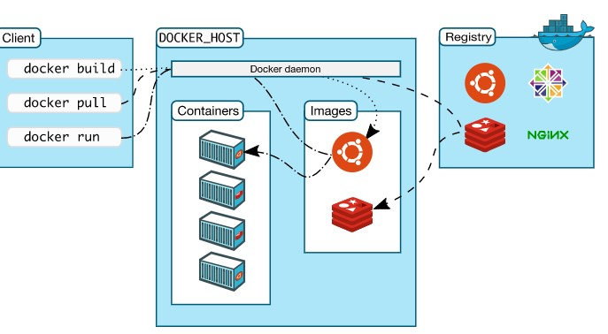

**Table of Content**
	<li>What is docker and it's advantage?</li>
	<li> Difference between container and virtual machine</li>
	<li> What is docker engine and it's architecutre?</li>
	<li> What is Docker image,registry and container?</li> 
	<li> What is snapshot ?</li>
	<li> Why guest OS not required in the docker container?</li>
	<li> What is kernel?</li>
	<li> Difference between kernel space and user space</li>
	<li> Deference between deamon and process?</li>
	<li> Deep drive regarding hasing function</li>
	<li> What is the meaning of ephemeral ?</li>
	<li> What is REST API and how it's work.</li>
	 <li>What is database persistence layer?</li>
	
<h2>What is Docker</h2>
Docker is a platform for developers and sysadmins to  **build, run, and share**  applications with containers. The use of containers to deploy applications is called  _containerization_. Containers are not new, but their use for easily deploying applications is.
<h3>Advantage of docker</h3>

-   **Flexible**: Even the most complex applications can be containerized.
-   **Lightweight**: Containers leverage and share the host kernel, making them much more efficient in terms of system resources than virtual machines.
-   **Portable**: You can build locally, deploy to the cloud, and run anywhere.
-   **Loosely coupled**: Containers are highly self sufficient and encapsulated, allowing you to replace or upgrade one without disrupting others.
-   **Scalable**: You can increase and automatically distribute container replicas across a datacenter.
-   **Secure**: Containers apply aggressive constraints and isolations to processes without any configuration required on the part of the user.
<h2>Container vs Virtual Machine</h2>
A container runs  _natively_  on Linux and shares the kernel of the host machine with other containers. It runs a discrete process, taking no more memory than any other executable, making it lightweight.

By contrast, a  **virtual machine**  (VM) runs a full-blown “guest” operating system with  _virtual_  access to host resources through a hypervisor. In general, VMs incur a lot of overhead beyond what is being consumed by your application logic.

## Docker Engine

_Docker Engine_  is a client-server application with these major components:

-   A server which is a type of long-running program called a daemon process (the  `dockerd`  command).
    
-   A REST API which specifies interfaces that programs can use to talk to the daemon and instruct it what to do.
    
-   A command line interface (CLI) client (the  `docker`  command).

The CLI uses the Docker REST API to control or interact with the Docker daemon through scripting or direct CLI commands. Many other Docker applications use the underlying API and CLI.

The daemon creates and manages Docker  _objects_, such as images, containers, networks, and volumes.

## What can I use Docker for?

**Fast, consistent delivery of your applications**

Docker streamlines the development lifecycle by allowing developers to work in standardized environments using local containers which provide your applications and services. Containers are great for continuous integration and continuous delivery (CI/CD) workflows.

Consider the following example scenario:

-   Your developers write code locally and share their work with their colleagues using Docker containers.
-   They use Docker to push their applications into a test environment and execute automated and manual tests.
-   When developers find bugs, they can fix them in the development environment and redeploy them to the test environment for testing and validation.
-   When testing is complete, getting the fix to the customer is as simple as pushing the updated image to the production environment.

**Responsive deployment and scaling**

Docker’s container-based platform allows for highly portable workloads. Docker containers can run on a developer’s local laptop, on physical or virtual machines in a data center, on cloud providers, or in a mixture of environments.

Docker’s portability and lightweight nature also make it easy to dynamically manage workloads, scaling up or tearing down applications and services as business needs dictate, in near real time.

**Running more workloads on the same hardware**

Docker is lightweight and fast. It provides a viable, cost-effective alternative to hypervisor-based virtual machines, so you can use more of your compute capacity to achieve your business goals. Docker is perfect for high density environments and for small and medium deployments where you need to do more with fewer resources.

## Docker architecture

Docker uses a client-server architecture. The Docker  _client_  talks to the Docker  _daemon_, which does the heavy lifting of building, running, and distributing your Docker containers. The Docker client and daemon  _can_  run on the same system, or you can connect a Docker client to a remote Docker daemon. The Docker client and daemon communicate using a REST API, over UNIX sockets or a network interface.

